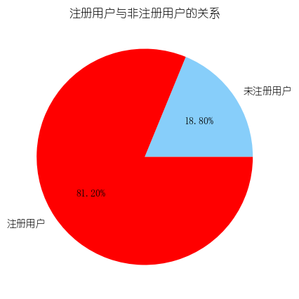
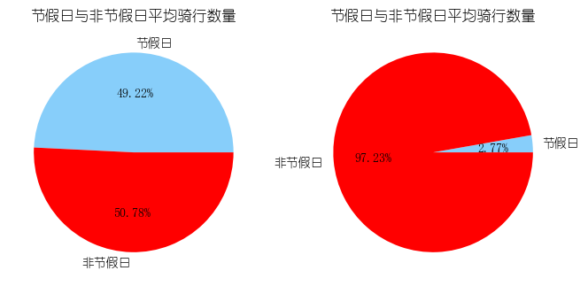
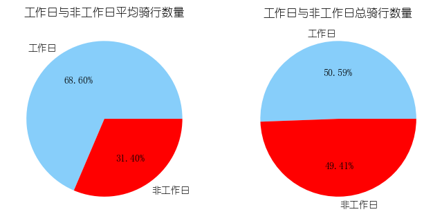
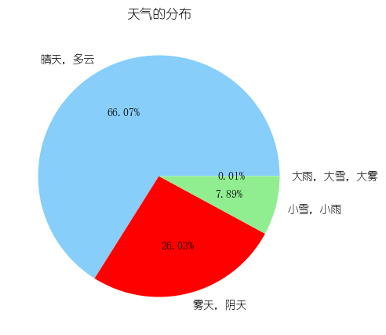
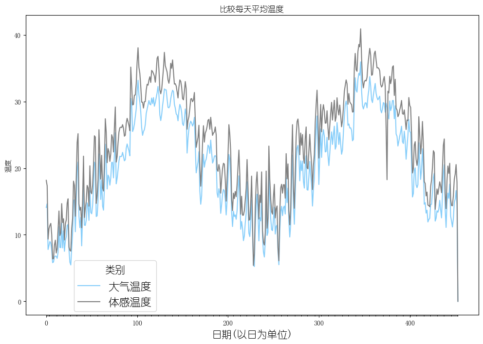
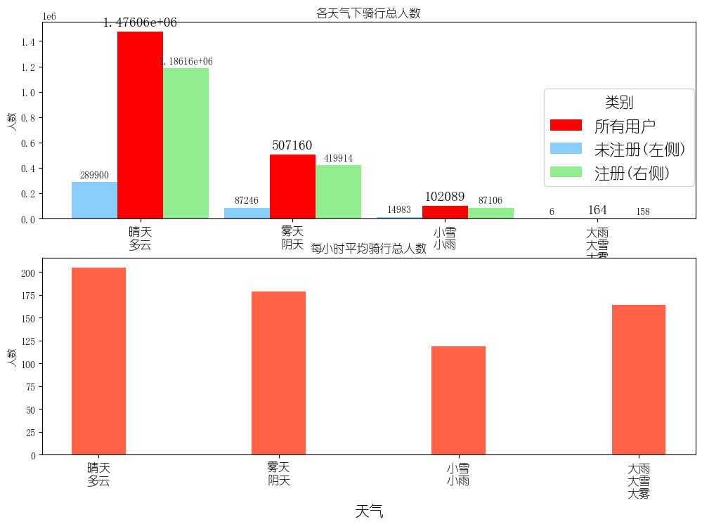
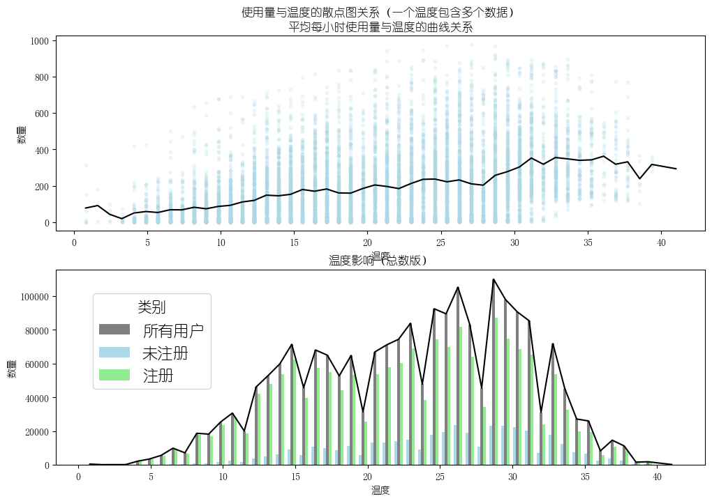
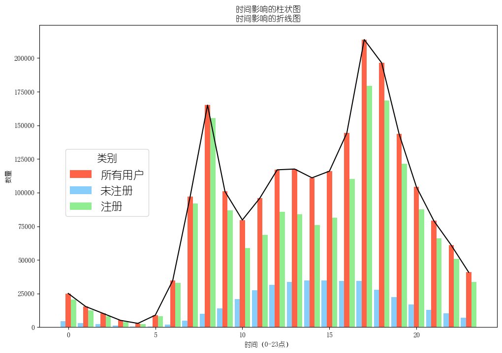

# 共享单车租用影响因素分析

本项目基于共享单车使用数据，结合天气、时间、温度等多维度因素，进行可视化分析与建模预测，旨在探索影响租用量的关键变量。


---

## 图表展示（部分结果）

### 用户租用比例饼图


### 不同天气下租用占比


### 工作日与周末对比


### 年龄段分布


### 租用量时间序列


### 天气与租用量条形图


### 气温与租用量关系


### 时间分布与租用统计


---

## 📌 使用说明

1. 克隆项目到本地：
   ```bash
   git clone https://github.com/你的用户名/仓库名.git
